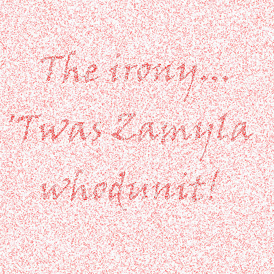
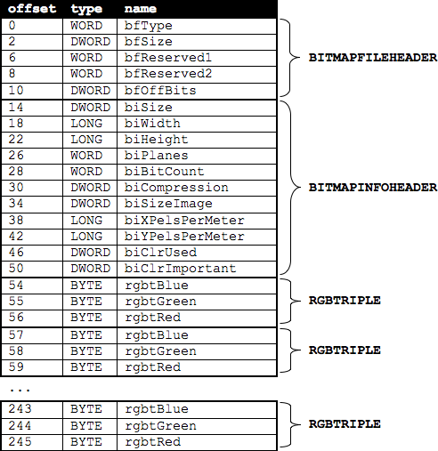

# Whodunit.c

 This is a program that filter out the red noise in a picture and reveal the hidden clue.

The Clue picture looks like this:
 

Clue revealed:

## Bitmaps

 An image can be seen as a sequence of pixels, and every pixel is composed of certain bits. A file format (like BMP, JPEG or PNG) that supports "24-bit color" uses 24 bits per pixel, in which there are 8 bits of red, 8 bits of green and 8 bits of blue, and together they make up the color of a pixel.

 A BMP file also contains some "metadata" that stored at the beginning of the file in the form of two data structures referred to as "headers". `BITMAPFILEHEADER` is 14 bytes long, `BITMAPINFOHEADER` is 40 bytes long.

 Immediately following these headers is the actual bitmap: an array of bytes, triples of which represent a pixel’s color. (In 1-, 4-, and 16-bit BMPs, but not 24- or 32-, there’s an additional header right after `BITMAPINFOHEADER` called `RGBQUAD`, an array that defines “intensity values” for each of the colors in a device’s palette.) However, BMP stores these triples backwards (i.e., as BGR), with 8 bits for blue, followed by 8 bits for green, followed by 8 bits for red. (Some BMPs also store the entire bitmap backwards, with an image’s top row at the end of the BMP file).

## bmp.h

`bmp.h` contains BMP-related data types based on Microsoft's own implementation: `BYTE`, `DWORD`, `LONG`, `WORD`.
Also it defines the `struct` of `BITMAPFILEHEADER` and `BITMAPINFOHEADER`, followed by `RGBTRIPLE`  1 byte blue, 1 byte green and 1 byte of red.

The attribute `packed` ensures that `clang` does not try to "word-align" members (whereby the address of each member's first byte is a multiple of 4).